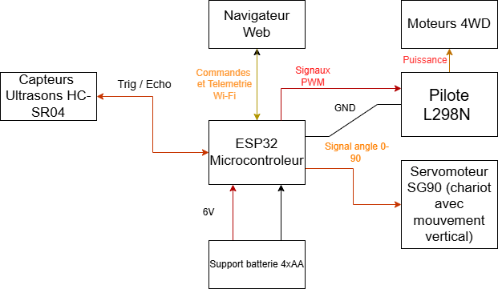

# LE PATRON AGV

| | |
|-|-|
|`Author` | Stoian Victor Ioan

## Description
Ce projet met en œuvre un prototype de Véhicule à Guidage Automatique ou bien AGV conçu pour la logistique intelligente, l'automatisation des entrepôts et la manutention automatisée des matériaux. J'ai utilisée un microcontrôleur ESP32, le robot 4WD exploite un capteur à ultrasons HC-SR04 pour scanner l'environnement et maintenir une distance de sécurité en utilisant un algorithme de commande PID (Proportionnel-Intégral-Dérivé). 
Cela garantit une accélération et une décélération fluides, évitant ainsi les chocs mécaniques sur la charge utile. En plus de la navigation intelligente, l'AGV est équipé d'un mécanisme de chariot élévateur automatisé monté à l'avant et actionné par un servomoteur à couple élevé. 
Cela permet au robot de simuler la préhension, le levage et le dépôt de charges utiles ou de mini-palettes. L'ensemble du système (télémétrie, réglage du PID et commande manuelle du chariot élévateur) peut être surveillé et contrôlé via un Serveur Web hébergé directement sur l'ESP32.
## Motivation
Dans le contexte de l'Industrie 4.0, les centres de distribution e-commerce et les entrepôts intelligents s'appuient fortement sur des robots capables à la fois de naviguer de manière autonome et de manipuler des matériaux.
Si le maintien de la distance est une excellente fonction de sécurité, l'opération centrale de la logistique reste le déplacement des marchandises. En intégrant un mécanisme de chariot élévateur actionné par servomoteur au régulateur de vitesse adaptatif PID, ce projet reproduit fidèlement les deux tâches fondamentales d'un robot d'entrepôt industriel : un transport sûr et fluide, ainsi qu'une manipulation automatisée de la charge.
## Architecture

### Block diagram

<!-- Make sure the path to the picture is correct -->

### Schematic

### Components

<!-- This is just an example, fill in with your actual components -->

| Device | Usage | Price |
|--------|--------|-------|
| Carte de développement ESP32 | Cerveau du projet | [41.1 RON](https://sigmanortec.ro/placa-dezvoltare-esp32-ch340c-30p-usb-c-wifi-si-bluetooth) |
| Capteur à Ultrasons HC-SR04 | Mesure de la distance pour le Régulateur de Vitesse Adaptatif | [8 RON](https://sigmanortec.ro/Senzor-ultrasunete-HC-SR04-p125423514) |
|Kit Châssis Voiture Intelligente 4WD| Châssis du robot + 4 Moteurs à courant continu (DC) | [83 RON](https://sigmanortec.ro/Kit-sasiu-Smart-Car-4WD-p136281803) |
| Pilote de Moteur L298N | Pont en H pour contrôler la direction et la vitesse (PWM) | [19,29 RON](https://sigmanortec.ro/Punte-H-dubla-L298N-V1-p159802198) |
|Servomoteur MG996R / SG90 |Actionneur pour le mécanisme de levage du chariot | [9,50 RON](https://sigmanortec.ro/Servomotor-SG90-limit-switch-p141662062)|
| Support de Batterie 4xAA | Alimentation séparée pour le L298N (Moteurs) & l'ESP32|[6.34 RON](https://sigmanortec.ro/Suport-4-baterii-AA-cu-capac-si-intrerupator-p172447738) |
|Platine d'Essai (Breadboard) 400 pts | Prototypage du circuit | [6 RON](https://sigmanortec.ro/Breadboard-400-puncte-p129872825) |
|Fils de Connexion (Jumper Wires) Dupont | Connexion des composants (M-M & M-F) |[8 RON](https://sigmanortec.ro/40-fire-Dupont-10cm-Tata-Mama-p210855157)|
### Libraries

| Library | Description | Usage |
|--------|--------|-------|
|[WiFI.h](https://docs.arduino.cc/libraries/wifi/)|Bibliothèque Wi-Fi intégrée à l'ESP32|Utilisée pour connecter l'ESP32 à un réseau afin d'héberger le Serveur Web de télémétrie.|
|[WebServer.h](https://github.com/espressif/arduino-esp32/tree/master/libraries/WebServer) |Serveur Web intégré à l'ESP32 |Utilisé pour fournir le tableau de bord HTML/CSS au navigateur client. |
|[NewPing](https://bitbucket.org/teckel12/arduino-new-ping/src/master/) | Bibliothèque de capteur à ultrasons par Tim Eckel | Utilisée pour obtenir des mesures de distance très précises depuis le HC-SR04. |
| [PID_v1](https://github.com/br3ttb/Arduino-PID-Library) | Bibliothèque de contrôleur PID par Brett Beauregard | Utilisée pour convertir l'erreur de distance en une sortie PWM fluide pour les moteurs. |
| [ESP32Servo](https://github.com/madhephaestus/ESP32Servo) | Bibliothèque Servo optimisée pour l'ESP32 | Utilisée pour générer des signaux PWM matériels précis pour contrôler le mécanisme du chariot élévateur. |

## Log

### Week 6 - 12 May
-Assemblage du châssis physique 4WD et montage des moteurs DC. \
-Soudure des fils aux moteurs et connexion des paires gauche/droite en parallèle aux sorties du Pont en H L298N. \
-Mise en place d'un schéma de distribution d'alimentation sécurisé, garantissant que la logique de l'ESP32 est isolée des pics de tension des moteurs. 
### Week 7 - 19 May
-Montage du capteur HC-SR04 et intégration de la bibliothèque NewPing. \
-Conception et assemblage de la structure mécanique du chariot élévateur à l'avant du châssis. \
-Installation du Servomoteur et intégration de la bibliothèque ESP32Servo pour tester les fonctions de levage et de descente (0 à 90 degrés) 
### Week 20 - 26 May
-Remplacement de la logique de collision de base par l'algorithme PID_v1 pour un Régulateur de Vitesse Adaptatif fluide. \
-Réglage des constantes Kp, Ki et Kd pour obtenir une accélération et un freinage fluides, maintenant la charge du chariot élévateur stable. \
-Développement du tableau de bord du Serveur Web de l'ESP32, ajout de boutons pour déclencher manuellement le chariot élévateur et surveiller les métriques PID en temps réel. 

## Reference links

<!-- Fill in with appropriate links and link titles -->

[Comprendre la Commande PID](https://www.youtube.com/watch?v=wdgULBpRoXk&t=1s&ab_channel=BenEater](https://www.youtube.com/watch?v=wkfEZmsQqiA))

[Tutoriel ESP32 avec Pilote de Moteur L298N](https://randomnerdtutorials.com/esp32-dc-motor-l298n-motor-driver-control-speed-direction/)

[Guide de Contrôle des Servomoteurs avec ESP32](https://randomnerdtutorials.com/esp32-servo-motor-web-server-arduino-ide/)
